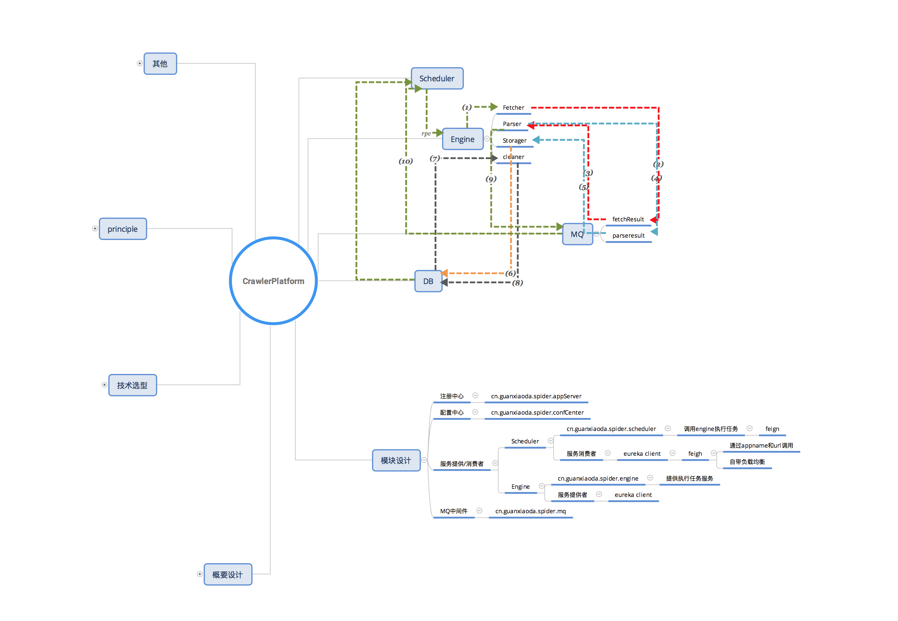

## spider center

### progress

- service register    

- config center    
- service  
    - provider 
    
        提交任务
    - consumer    
    
        接收任务成功

### 架构

### 消息格式约定

#### task

### host&ports

- localhost:
    - 8100: register center
    - 820x: service provider: crawler engine
    - 830x: service consumer: scheduler