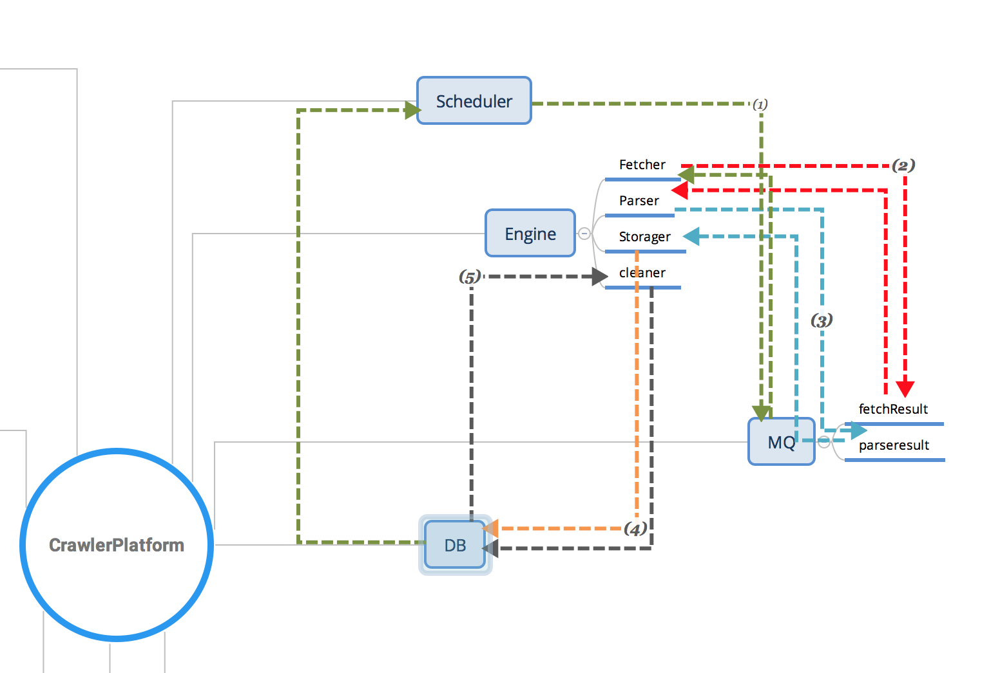

## spider center

### progress

- service register    

- config center    
- service  
    - provider 
    
    - consumer    
    

### 架构


### 约定

#### api
scheduler:
```
接收任务: 
post /crawlTask
body:
task json str
```


#### task

``` java

    meta: Map<String, String>

```


### host&ports

- localhost:
    - 8100: register center
    - 820x: service provider: crawler engine
    - 830x: service consumer: scheduler